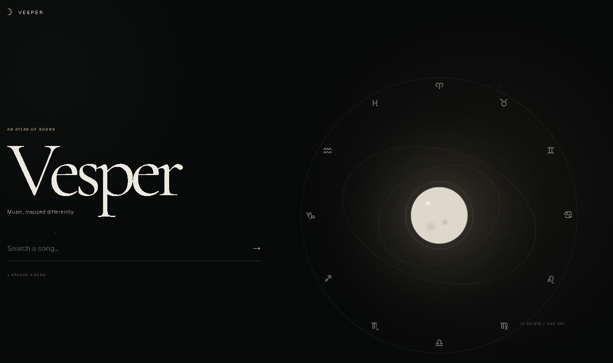
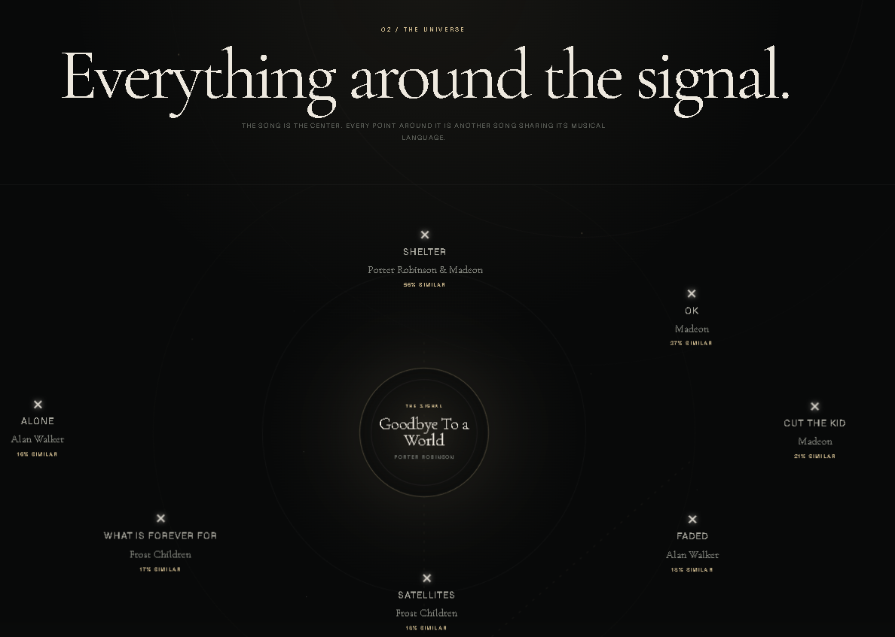
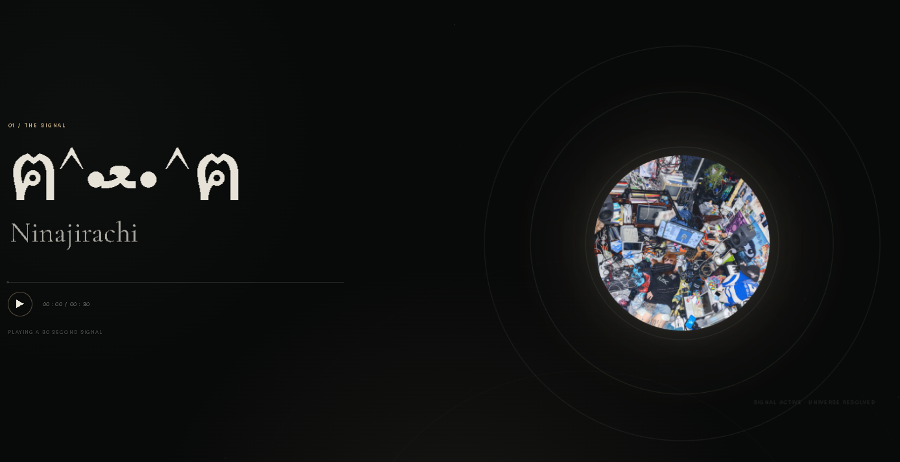

# Vesper

### Music, mapped differently.

<p align="center">
  
</p>

<p align="center">
  <i>An experimental music discovery experience built around the connections between songs.</i>
</p>

---

## The idea

Most music discovery experiences give you a list.

**Vesper gives you a universe.**

Search for a song and explore the music surrounding it through an interactive visual map. Instead of treating songs as isolated results, Vesper turns music discovery into an experience built around connections, exploration, and sound.

The goal was simple:

> **Make music discovery feel like exploration.**

---

## The Universe

<p align="center">
  
</p>

Every song becomes a center point.

Vesper uses real music data to build a visual universe around the selected track, revealing related artists and songs as connected signals.

Explore outward from one song and see where the music takes you.

---

## Follow the Signal

<p align="center">
  
</p>

Select a signal and listen while continuing to explore.

Vesper combines music discovery with audio playback so finding something new doesn't mean leaving the experience.

---

## The Experience

Vesper was designed to feel less like a traditional web application and more like entering a different space.

Dark celestial visuals, subtle motion, typography, orbital layouts, and restrained color create the visual language of the project.

---

## How it works

Vesper is built around several music APIs working together rather than relying on a single source.

```text
                         SEARCH
                           │
                           ▼
                    ┌─────────────┐
                    │   iTunes    │
                    │   / Deezer  │
                    └──────┬──────┘
                           │
                           ▼
                    SELECT A SONG
                           │
                           ▼
                  ┌─────────────────┐
                  │  SONG + ARTIST  │
                  │     METADATA    │
                  └────────┬────────┘
                           │
             ┌─────────────┼─────────────┐
             ▼             ▼             ▼
         Last.fm        Deezer       SoundCloud
        relationships    metadata       playback
             │             │             │
             └─────────────┼─────────────┘
                           ▼
                  BUILD THE UNIVERSE
                           │
                           ▼
                    EXPLORE + LISTEN
